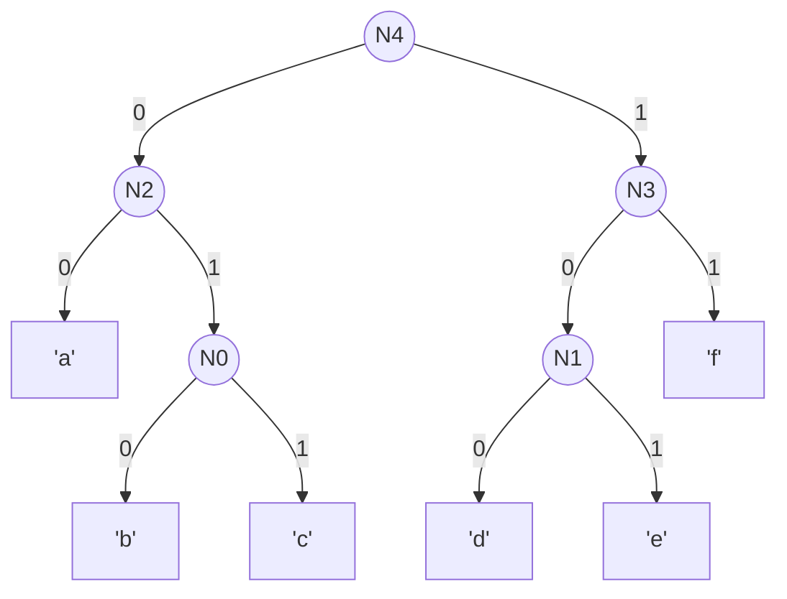

### 土曜日

朝は雨、以降は晴れ。肌寒い日。

昨日だらだらネットサーフィンしてたら以下の記事を見つけた：

https://note.com/jiyukoh/n/ndaf3c776d7cf

内容が気になったので、入手方法を調べてみる。
オンラインだと[このページ](https://rnuso.stores.jp/items/6358f0bc4b08397047d8abc1)から買えるみたい。
できれば中身をパラパラと覗き見したいので、扱っている実書店がないかと調べてみると
[RIGHT NOW BOOKSTAND](https://rnuso.stores.jp/)というお店が武蔵野市桜堤にあるらしい。

歩いていけそう（片道50分）なので、散歩がてら行ってみる。12時前に出発。

経路はひたすら玉川上水沿いを西北西に進む。
東京に住んで一年ほどだが、このあたりは初めて歩く。
道中に東京都水道局境浄水場があった：

このあたりの玉川上水沿いの道は「桜通り」というらしい。
街路樹が桜なのか見てもわからないが、たぶんそうなんだろう：

歩道としては人がすれ違うにはやや余裕がない狭さ：

このあたりを太宰とか [Shiro Kawai](https://twitter.com/anohana) さんが歩かれたのかね。

そこそこ歩いて到着。わりと疲れた：

店内はオフィス兼ミニ書店みたいだった。
写真の窓枠左下に背中が写っているのはエキゾチックショートヘアという猫だった。
入店時はぬいぐるみかと思ってたので、会計時に動き出してびっくりした。
ふてぶてしい老猫という感じで良かった。

帰りはスタバに寄って、プログラミングや USO4 の読書を進めた：

背後に座られていたおかんと息子と会話がおもしろかった。
好奇心の強い子供のようで、いろんなテーマでしきり会話をしていた：

- 何故 1 + 1 は 2 ?
- ヴェニスの商人のエピソードについて
    - 胸の肉１ポンドのあれ（僕はよく知らない）
- 生理について
    - 始まる時期と体内で起こること

いい時間を過ごしてる二人だなーと微笑ましかった。
帰り際に子供がチョコチップスコーンをねだりはじめて、
おかんが必死に買わない理由を挙げて説得していたが、最後は根負けしたようで二人でレジに並んでた。

帰り道にいなげや武蔵野関前店に寄った。ハライチのターンでちょこちょこエピソードに出てくるため親近感がある。
店内は広く、品数も多い。少し遠いが休日に来るには良さそう。

### deflate 自作

folly を呼んでて deflate が出てきたので、理解するため自作してみることにする。
とりあえず Huffman 木の作成まで：

https://github.com/toasa/DIY_deflate/blob/main/main.go

Huffman 木の作成は以下のビデオを参考にした：

https://www.youtube.com/watch?v=0kNXhFIEd_w

---

悩んでいるところとして、符号化したデータをどういうデータ構造で持っておけばよいのだろう。
例えば以下の Huffman 木の場合（github markdownって mermaid 使えるんすね。ｽｺﾞｰｲ）：

'c' は `011`, 'f' は `11` に符号化されるが、両者を整数値とみなすと、値が一致してしまう。
現在は文字列型として[扱っている](https://github.com/toasa/DIY_deflate/blob/main/main.go#L17)が、0 と 1 しか無いので明らかに割鶏牛刀なんだよね。

２値を格納する可変長なコンテナ型であればよいので、`bool` のスライスが候補に上がるが、Golang のスライス型は hashable ではなく、`map` の key にできない。Huffman 木を作ったあとで、文字と符号の map を作りたいので、
`bool` のスライスではだめそう。

LZ77も適当なビデオを探すか。